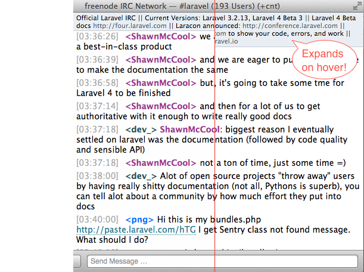

#Simplified Light-Retouch
This is a retouch of the simplified light theme/style for the <a href="http://www.codeux.com/textual/">Textual IRC</a> client, which focuses mainly on modifying the topic bar.  The style adopts a topic bar similar in style to the sidebar.  Also, it makes the text smaller and will only show two lines of the topic by default.  For really long topics: hover over the topic bar to see the full topic.

Another feature is that channels now appear as links, which can be opened with a single click.This was added because I did not even know you could right click or double click a channel name to perform an action (both of which still work with this style).

##Screenshot

Here's a split-view screenshot showing the window when the topic is not hovered over (2-line max) on the left, and the full topic exposed when hovered on the right.

##Install
To install, <a href="https://github.com/memco/simplified-light-retouch/archive/master.zip">download the zip file</a> (or clone this repo) and put the enclosed folder in `~/Library/Application Support/Textual IRC/Styles/`.