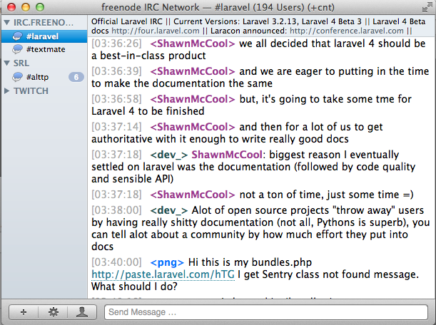
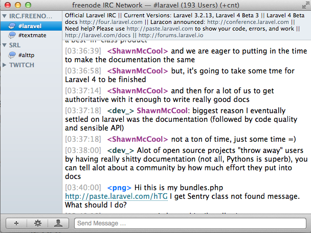

#Simplified Light-Retouch
This is a retouch of the simplified light style for the <a href="http://www.codeux.com/textual/">Textual IRC</a> client, which focuses mainly on modifying the topic bar.  The style adopts a topic bar similar in style to the sidebar.  Also, it makes the text smaller and will only show two lines of the topic by default.  For really long topics: hover over the topic bar to see the full topic.

##Screenshots

Here's the window when the topic is not hovered over (2-line max)

This is the window when you hover over the topic bar
